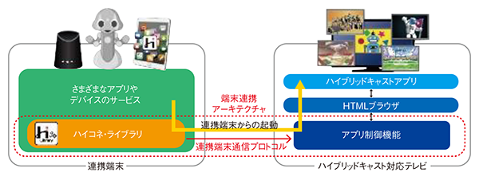
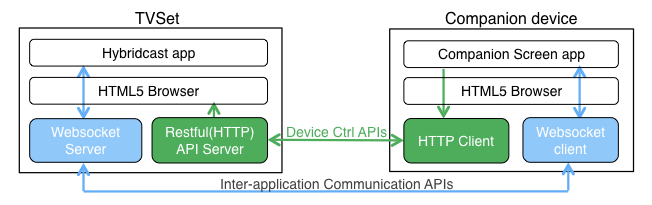
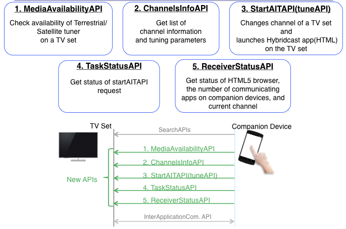
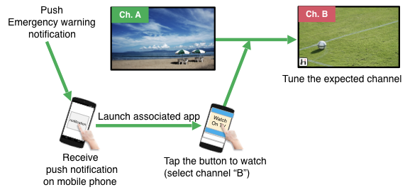
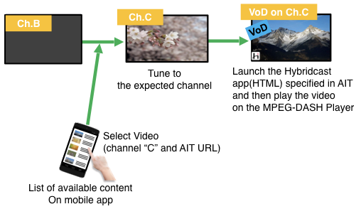
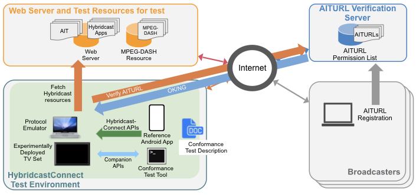

# Hybridcast Connect

Hybridcast-Connect Standardization and Hybridcast Connect Protocol

ハイブリッドキャストコネクト規格とハイブリッドキャストコネクトプロトコル




# Overview

"Hybridcast-Connect" is the standardization opend at Sep.2018 in IPTV Forum Japan. Hybridcast-Connect can realize to control parts of the function of tuner on a TV Set from application outside of the tuner , and communicate through text message between the TV Set and some applications. This document is the simple instraction of that standardiation and protocol.


ハイブリッドキャストコネクトは、IPTV Forum Japanにおいて2018年９月に標準規格化された「ハイブリッドキャスト技術仕様および運用規定」(以後、ハイコネ)の、仕様またはプロトコル(V2)のことを指します.ハイコネを利用すると、放送受信機能の一部の制御を受信機外のアプリケーションから実行でき、その受信機および受信機上のHybridcastサービスのブラウザアプリケーションと通信もできます.本ドキュメントでは、ハイコネ規格およびプロトコルについて簡単に紹介をします.


# Architecture/Components in Hybridcast Connect



([W3C TPAC 2019: RecentAchievementHybridcast](https://www.w3.org/2011/webtv/wiki/images/d/d3/RecentAchievementHybridcast_TPAC20190916.pdf) p.6 "Trial deployment 'Hybridcast-Connect'"のスライドから抜粋）


In the Hybridcast Connect, some devices and applications have appeared , these are as below;

- TV set
    - Hybridcast application

        Hybridcast is the service launching since 2013. Hybridcast application is HTML(web) application on Hybridcast browser on a TV Set. The application is able to call javascript APIs that enables to control TV Set and utilize broadcasting resources and so on. For more detail, see specification "[IPTVFJ STD-0011](#iptvfj-std-0011)"

    - Hybridcast Browser

        It may be embedded HTML5 browser. see its defined in the specification "IPTVFJ STD-0011 [1]". HTML(web) application on the browser is supposed to be served by service provider such as broadcasters. A HTML application on the browser can communicate with the javascript APIs that are defined in the specifications "IPTVFJ STD-0011 [1] 3.1.23" and "[IPTVFJ STD-0013](#iptvfj-std-0013) 6.2.4.20".

    - Hybridcast Connect Application Control Module

        - Device Control(defined as RESTAPIs)

            It is the module of the function to control TV Set. It is implemented as the RESTAPIs that a application on Companion Application can control TV set. see the specification "[IPTVFJ STD-0013](#iptvfj-std-0013) 7.2.3.3".

        - Inter-Application Communication(defined as WebsocketAPIs and Javascript APIs in Hybridcast browser)

            It is the module of the function to control TV Set. It is implemented as the WebsocketAPIs that a application on Companion Application connect and communication with message between its application and a HTML application on the Hybridcast browser. see the specification "[IPTVFJ STD-0013](#iptvfj-std-0013) 7.2.3.1".

- Companion Application

    - Hybridcast Connect Client Module
    
        It may be implemented as SDK/Library. There is no official ones.

        - Device control

            It is the module of the function to control TV Set. It is implemented as the HTTP Client that request RESTAPIs offerd from servers in TV Set. see the specification "[IPTVFJ STD-0013](#iptvfj-std-0013) 7.2.3.3".

        - Inter-application communication

            It is the module of the function to communicate between companion application as a client and a HTML application on the Hybridcast browser. It is implemented as the Websocket Client that connect WebsocketAPI offered from a server in TV Set and communicate with message defined in the specification. For more detail, see message format over websocket commucation in the specification "[IPTVFJ STD-0013](#iptvfj-std-0013) 7.2.3.1".

    - HTML5 Browser

        To use Hybridcast-Connect APIs as a client, it is not nessesary to implement HTML5 browser and HTML(Companion Screen App). 
        It assumes that if the application from some services is likely to serve as HTML(web), any HTML5 browser must be required on client device. The browser is expected to implement the functions of Hybridcast-Connect as recommended javascript APIs that are defined in in the specification "[IPTVFJ STD-0013](#iptvfj-std-0013) 7.1.7". 

    - Companion Screen Application

        It is implemented as HTML(web) application on the HTML5 browser. The Hybridcast Connect Specification define several javascript APIs as recomendation that are able to call the function of device control and inter-application communication implemented in the Hybridcast Connect Client Module. In detail, see the recommendation of javascript APIs in the specification "[IPTVFJ STD-0013](#iptvfj-std-0013) 7.1.7".


---

ハイブリッドキャストコネクトにおいては、複数のデバイスやソフトウェアアプリケーションが登場します.

- TV受信機デバイス
    - ハイブリッドキャストアプリ
        ハイブリッドキャストは2013に開始されたサービスで、TV受信機に搭載されたHybridcastブラウザ上でサービスされます.
        ハイブリッドキャストアプリは、そのHybridcastブラウザ上で動作するインターネット経由で提供されるHTML(web)アプリであり、テレビ受信機の制御や放送リソースを利用することができます.詳細仕様は、”[IPTVFJ STD-0011](#iptvfj-std-0011)”を参照.
        
    - ハイブリッドキャストブラウザ

        TV受信機上で動作する組み込みHTML5ブラウザ.詳細仕様は、 ”[IPTVFJ STD-0011](#iptvfj-std-0011)” を参照.
        ブラウザ上で動作するHTML(Web)アプリは放送局などのサービスプロバイダによって提供される.
        受信機制御や放送リソース、ハイブリッドキャストコネクトの機能は、javascriptAPIを実装することで実現されます.ハイブリッドキャストコネクトのjavascriptAPIについては、"[IPTVFJ STD-0011](#iptvfj-std-0011)  3.1.23" and "[IPTVFJ STD-0013](#iptvfj-std-0013)  6.2.4.20"を参照.

    - ハイブリッドキャストコネクト アプリ制御モジュール

        - 外部起動制御機能

            受信機の制御機能モジュール.RESTAPIでその機能が提供される.詳細は、[IPTVFJ STD-0013](#iptvfj-std-0013) 7.2.3.3を参照

        - 連携端末通信機能

            クライアント相当のコンパニオンアプリと受信機または受信機に搭載されたHybridcastブラウザHTMLアプリケーションが通信する機能モジュール.受信機はWebsocketAPIとして本機能を実装してクライアントアプリに機能を提供し、メッセージコマンドにより通信・制御を行うよう仕様で決められている.詳細なメッセージコマンドのフォーマットや通信方法については、[IPTVFJ STD-0013](#iptvfj-std-0013) 7.2.3.1を参照.

- コンパニオンアプリ（連携端末アプリ）

    - ハイブリッドキャストコネクト クライアントモジュール

        - 外部起動ロンチャー機能

            受信機制御機能をリクエストするためのモジュール.受信機上のRESTAPIにリクエストを実行する、HTTPクライアントとして実装される.詳細は、[IPTVFJ STD-0013](#iptvfj-std-0013) 7.2.3.3.

        - 連携端末通信機能

            コンパニオンアプリと受信機に搭載されたHybridcastブラウザ上のHTMLアプリ間で通信するための機能モジュール.Websocketクライアントとして実装され、websocket通信上で送受信するメッセージコマンドについては規格で決められている.詳細なメッセージフォーマットとwebsocket通信の仕様については、[IPTVFJ STD-0013](#iptvfj-std-0013) 7.2.3.1"参照.

    - HTML5ブラウザ

        ハイブリッドキャストコネクトのAPIをリクエストするクライアントは必ずしもwebブラウザ上のHTMLアプリとして実装する必要はないが、サービスとしてHTMLアプリを利用したい場合に、webブラウザからハイブリッドキャストコネクトのAPIをリクエストしたい場合を想定して、webブラウザ上利用するための共通のJavascriptAPIを規格として定義した.詳細は、[IPTVFJ STD-0013](#iptvfj-std-0013) 7.1.7. 

    - コンパニオンHTMLアプリ（連携端末HTMLアプリ）

        HTML5仕様のwebBrowser上で動作するHTML(web)アプリ.ハイブリッドキャストコネクトの仕様では、受信機上のRESTAPIやwebsocketAPIをwebBrowser上のHTMLクライアントアプリから実行するためのjavascriptAPIを決めている.詳細は、[IPTVFJ STD-0013](#iptvfj-std-0013) 7.1.7を参照.

### ------ Reference ------

##### IPTVFJ STD-0011
[IPTVFJ STD-0011](http://www.iptvforum.jp/download/input.html) "HTML5 Browser Specification Version 2.5", [http://www.iptvforum.jp/download/input.html](http://www.iptvforum.jp/download/input.html)
##### IPTVFJ STD-0013
[IPTVFJ STD-0013](http://www.iptvforum.jp/download/input.html)  "Hybridcast Operational Guideline Version 2.8", [http://www.iptvforum.jp/download/input.html](http://www.iptvforum.jp/download/input.html)


# Hybridcast Connect system flow

In the Hybridcast Connect Service, it assumes that a software application and a TVset communicate between both of these and send messages so that the messages control device or application on each device(TVSet, Mobiledevice, some other devices). Here is a typical sequence of the service with Hybridcast Connect below.

ハイブリッドキャストコネクトを使ったサービスでは、ソフトウェアアプリとTV受信機デバイスが通信し、それぞれを制御したり、メッセージを送受信することできます.

サービスにおける典型的なフローは以下です.



- (Preparation): ソフトウェアアプリケーション（モバイルアプリ）は、同じネットワーク上にいるTV受信機デバイスを発見する.(searchAPIs)
    - ソフトウェアアプリケーションのユーザーは発見したTV受信機デバイスを選択する（決める）
- ソフトウェアアプリケーションのサービスまたはユーザーのタイミングにしたがって、TV受信器デバイスの情報取得・制御をする.情報取得と制御の種類およびそのAPIは以下です.
    1. TVチューナー機能が受信可能なメディア情報の取得(MediaAvailabilityAPI)
    2. TVチューナーが選局可能な編成チャンネル情報の取得(ChannelsInfoAPI)
    3. TVチューナーの選局、または選局後にHybridcastアプリ（HTMLアプリ）の指定してロード（起動）(StartAPI(tuneAPI))
    4. TVチューナーに対して選局制御されたタスクの状態の取得(TaskStatusAPI)
    5. TV受信機デバイスおよびTVチューナー機能の状態の取得(ReceiverStatusAPI)
- (After Preparation)ソフトウェアアプリケーションのサービスまたはユーザーのタイミングにしたがって、TV受信機デバイスまたはTV受信機デバイスに搭載されたHybridcastブラウザ上のHTMLアプリケーションと連携端末通信プロトコルを利用するAPI(inter-device protocol/inter-ApplicatoinCommunicationAPI)を使って以下機能を実行する.
    - Hybridcastアプリケーションへのテキストメッセージの送受信(SendTextAPI)
    - Hybridcastアプリケーションの指定する情報をソフトウェアアプリケーションが取得(SetURLAPI)

reference: [W3C TPAC 2018: RecentAchievementHybridcast](https://www.w3.org/2011/webtv/wiki/images/4/45/RecentAchievementHybridcast_TPAC20181022.pdf) , [W3C TPAC 2019: RecentAchievementHybridcast](https://www.w3.org/2011/webtv/wiki/images/d/d3/RecentAchievementHybridcast_TPAC20190916.pdf) ）


# USECASE

## Usecase1

モバイルアプリの通知を受信して受信機の選局（起動）をする.



[W3C TPAC 2019: RecentAchievementHybridcast](https://www.w3.org/2011/webtv/wiki/images/d/d3/RecentAchievementHybridcast_TPAC20190916.pdf) p.10 "Supposed use cases demo (1)"のスライドから抜粋

## Usecase2

モバイルアプリの通知を受信して受信機の選局とHybridcastアプリの起動（Browser起動+HTMLロード）をする.



[W3C TPAC 2019: RecentAchievementHybridcast](https://www.w3.org/2011/webtv/wiki/images/d/d3/RecentAchievementHybridcast_TPAC20190916.pdf) p.11 "Supposed use cases demo (2)"のスライドから抜粋


# Hybridcast Connect Protocol APIs

ハイコネ仕様規定API

ハイコネプロトコルおよびAPIをソフトウェア実装する場合に特に必要とする箇所を抜粋して紹介します.
詳細は、[IPTVFJ STD-0013](#iptvfj-std-0013) ハイブリッドキャスト運用規定 7章"を参照.


## Device Discovery

機器発見: [IPTVFJ STD-0013](#iptvfj-std-0013) 7.2.1

- 機器発見プロトコルとして[DIAL Protocol(1.7.2)](http://www.dial-multiscreen.org/)を使う.
    - 実質、DIALにおいて機器発見はUPnPで規定されたSSDPを使う.
    - SSDPにしたがってサーチリクエストすると、対応機器からのレスポンスヘッダーにデバイス情報(DeviceDescription)を取得するためのLocationURLを取得できる.
    - LocationURLからDeviceDescriptionのXMLを取得できる.ハイコネ規格においてはDeviceDescriptionの一部フィールドを決めている.([IPTVFJ STD-0013](#iptvfj-std-0013) 7.2.1.1.1)を参照.以下は[IPTVFJ STD-0013](#iptvfj-std-0013) 7.2.1.1.1)における記述例である.(LocationURLが192.168.1.11:11111/dd.xmlの時の例)
    ```
    $ curl -v 192.168.1.11:11111/dd.xml
    
    > GET /dd.xml HTTP/1.1
    > Host: 192.168.1.11:11111
    > User-Agent: curl/7.64.1
    > Application-URL: http://192.168.1.11:11111/apps

    <?xml version="1.0"?>
    <root xmlns="urn:schemas-upnp-org:device-1-0">
        <specVersion> <major>1</major> <minor>0</minor>
        </specVersion> <device>
        <deviceType>urn:dial-multiscreen-org:device:dial:1</deviceType> <friendlyName>Hogelin</friendlyName>
        <manufacturer>株式会社 XXXXX</manufacturer> <modelName>HogeTV-A123</modelName> <UDN>uuid:00000004-0000-1010-8000-d8d43c1923dc</UDN>
    </device> </root>
    ```
- 受信機上のハイコネ対応の情報(ApplicationInfomation)は[DIAL Protocol(1.7.2)](http://www.dial-multiscreen.org/)のDIALApplicationInformationAPIを利用する.
    - ApplicationInfoのURLは、"ApplicationResourceURL"と呼ぶ.
    - device descriptionリクエスト時のレスポンスヘッダーに含まれる"Application-URL"、を使う
    - "ApplicationResourceURL"は、"Application-URL/ApplicationName"のフォーマットとする.以下は取得したいApplicationを"Hybridcast"とした時のApplicationResourceURLの例.
        ```
        http://192.168.1.11:11111/apps/Hybridcast
        ```
- DIALinfAPIで取得するApplicationInfoのXMLデータにはハイコネ仕様で規格化した機能を使うための情報を含める.これらはDIAL Protocolにてオプション情報を提供するフォーマットであり以下に従う.
    - ApplicationDataに以下プロパティを含む.その記述例([IPTVFJ STD-0013](#iptvfj-std-0013) 7.2.1.1.2)は以下.
        - ServerInfoプロパティ"X_Hybridcast_App2AppURL"
        - tvcontrolURLのプロパティ"X_Hybridcast_TVControlURL"
        - websocketURLのプロパティ"X_Hybridcast_ServerInfo"
        ```
        $ curl -v http://192.168.1.11:11111/apps/Hybridcast

        > GET /apps/Hybridcast HTTP/1.1
        > Host: 192.168.1.11:11111
        > User-Agent: curl/7.64.1

        <-- [IPTVFJ STD-0013](#iptvfj-std-0013) 7.2.1.1.2 のXMLの記述例-->
        <?xml version="1.0" encoding="UTF-8"?>
        <service xmlns="urn:dial-multiscreen-org:schemas:dial"
                xmlns:iptv="urn:iptv:HybridcastApplication:2015" dialVer="1.7"> <name>Hybridcast Application</name>
            <options allowStop="false"/>
            <state>running</state>
            <additionalData>
                <iptv:X_Hybridcast_App2AppURL>
                    ws://192.168.1.11:1234/84fa-9fd3-33a1-2481-9098-3ccd-de26-a223/hybridcast
                </iptv:X_Hybridcast_App2AppURL>
                <iptv:X_Hybridcast_TVControlURL>
                    http://192.168.1.11:1235/hybridcast/tvcontrol
                </iptv:X_Hybridcast_TVControlURL>
                <iptv:X_Hybridcast_ServerInfo>
                    CCS/1.0;2.0;000000;0000000000;This-is-comment
                </iptv:X_Hybridcast_ServerInfo>
            </additionalData>
        </service>
        ```

## Device Setting Information

機器設定情報取得: [IPTVFJ STD-0013](#iptvfj-std-0013) 7.2.3.2.3.2

- 受信可能なメディア情報の取得(MediaAvailabilityAPI)

    ```
    $ curl [X_Hybridcast_TVControlURL]/media
    ```
    
    - response
        - json-schema参照: [availableMedia_schema.json](./sample/hcxp-json-schema/availableMedia_schema.json)
        
- 選局可能な編成チャンネル情報の取得(ChannelsInfoAPI)

   ```
   $ curl [X_Hybridcast_TVControlURL]/channels?media=MEDIA
   ```

    - response
        - json-schema参照: [channels_schema.json](./sample/hcxp-json-schema/channels_schema.json)

## StartAIT

ハイブリッドキャスト起動:[IPTVFJ STD-0013](#iptvfj-std-0013) 7.2.3.2.3.3

- 選局およびハイブリッドキャスト起動(StartAITAPI)

    TVチューナーの選局、または選局後にHybridcastアプリ（HTMLアプリ）の指定してロード（起動）(StartAITAPI(tuneAPI))
    
    ```
    $ curl -X POST -d @startAIT_request.json [X_Hybridcast_TVControlURL]/hybridcast
    ```

    - startAIT_request.json
    
        ```
        {
            "resource":{編成チャンネルの指定},
            "hybridcast":{起動するハイブリッドキャストの指定}
        }
        ```

    - json-schema参照
        - [startAIT_request_schema.json](./sample/hcxp-json-schema/startAIT_request_schema.json)
        - [startAIT_response_schema.json](./sample/hcxp-json-schema/startAIT_response_schema.json)


## Device Status

機器状態取得:[IPTVFJ STD-0013](#iptvfj-std-0013) 7.2.3.2.3.4

- 起動可否情報の取得(TaskStatusAPI)

     ```
    $ curl [X_Hybridcast_TVControlURL]/hybridcast
    ```

     - response
        - json-schema参照: [taskStatus_schema.json](./sample/hcxp-json-schema/taskStatus_schema.json)

- 受信機状態の取得(ReceiverStatusAPI)

    ```
    $ curl [X_Hybridcast_TVControlURL]/status
    ```

    - response
        - json-schema参照: [receiverStatus_schema.json](./sample/hcxp-json-schema/receiverStatus_schema.json)


## CompanionCommunication

連携端末通信.
websocket通信により以下機能を実現するためのAPI(文字列メッセージフォーマット)を規定している.

---

### sendtextToCompanionDevice

受信機（受信機上のハイブリッドキャストHTMLアプリ）から連携アプリにむけたテキスト送信する時のメッセージフォーマット.

- json-schema参照: [ws_sendTextToCompanionDevice_schema.json](./sample/hcxp-json-schema/ws_sendTextToCompanionDevice_schema.json)

### sendtextToHostDevice

連携アプリから受信機（受信機上のハイブリッドキャストHTMLアプリ）にむけたテキスト送信する時のメッセージフォーマット.

- json-schema参照: [ws_sendTextToHostDevice_schema.json](./sample/hcxp-json-schema/ws_sendTextToHostDevice_schema.json)

### setURLForCompanionDevice

受信機上のハイブリッドキャストHTMLアプリが受信機にセット可能なURLとタイトル情報などを受信機から連携アプリ送信するメッセージフォーマット.

- json-schema参照: [ws_setURLForCompanionDevice_schema.json](./sample/hcxp-json-schema/ws_setURLForCompanionDevice_schema.json)

### request

setURLForCompanionDeviceのリクエスト. 
受信機上のハイブリッドキャストHTMLアプリが受信機にセット可能なURLとタイトル情報などを連携アプリが受信機にリクエストするためのメッセージフォーマット.

- json-schema参照: [ws_requestSetURL_schema.json](./sample/hcxp-json-schema/ws_requestSetURL_schema.json)

### Extensions

拡張コマンドのメッセージオブジェクト.連携アプリが受信機に向けてコマンド情報を送信する時に利用する.

- json-schema参照: [ws_requestSetURL_schema.json](./sample/hcxp-json-schema/ws_extensionCommand_schema.json)


# ハイコネプロトコルテスト

IPTV Forum Japanではハイコネのプロトコルの規格仕様の実装検証のためのプロトコルテスト環境があります.

"hyconet4j"をはじめとするハイコネプロトコル関連ツールは、このプロトコル検証で利用されたツールの一部をOSS化したものです.




[W3C TPAC 2019: RecentAchievementHybridcast](https://www.w3.org/2011/webtv/wiki/images/d/d3/RecentAchievementHybridcast_TPAC20190916.pdf) p.13 "Conformance Test for Hybridcast-Connect"のスライドから抜粋