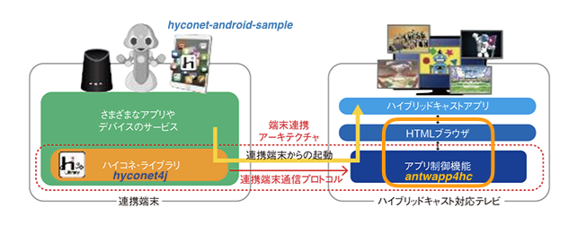
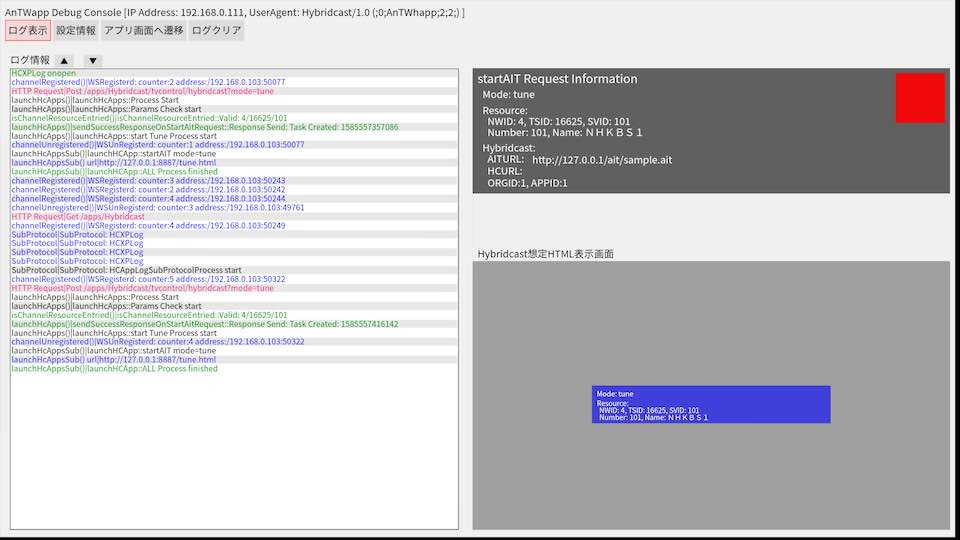

# Antwapp4hc

Android TV Websocketserver Application for "Hybridcast-Connect"

ハイブリッドキャストコネクトエミュレータ/
ハイコネプロトコルのサーバーサイドのAndroidTVアプリ実装

## Abstract

"antwapp4hc" is the Android App working on AndroidTV OS. This is the server-side reference implementation of the "Hybridcast-Connect" that was standardized at Sep.2018 in IPTV Forum Japan. The application expected to be connected from the "Hybridcast-Connect" reference client(SDK) "[hyconet4j](https://github.com/nhkrd/hyconet4j)". "Hybridcast-Connect" can realize to control some parts of the functions of a tuner on a TV Set from a application outside of the tuner , and communicate with text message between the TV Set and some applications.
 
The OSS, "antwapp4hc" is the part of the test tool that has been utilized as the verification of conformance test tool in the "Hybridcast-Connect" protocol in IPTV Forum Japan. Using "antwapp4hc", you can see how the process is working on the "Hybridcast-Connect" protocol.
For more details, see [About "Hybridcast-Connect"](./HybridcastConnect.md). For use of "antwapp4hc", see [LICENSE](./LICENSE.txt) and [NOTICE](./NOTICE.txt).

Antwapp4hcは、IPTV Forum Japanにおいて2018年９月に標準規格化された「ハイブリッドキャストコネクト」(以後、ハイコネ)のプロトコルに対応したサーバーサイド（TV受信機でいえばサーバーミドルウェア）に相当する機能のAndroidTVアプリ実装サンプルです.同じくハイコネプロトコルのクライアントSDK実装である[hyconet4j](https://github.com/nhkrd/hyconet4j)と対向で利用することができます.ハイコネを利用すると、放送受信機能の一部の制御を受信機外のアプリケーションから実行でき、その受信機および受信機上のHybridcastサービスのブラウザアプリケーションと通信もできます.本アプリケーションは、受信機側のサーバーサイドのエミュレーターとして、ハイブリッドキャストコネクトのプロトコルテストで利用されているツールの一部をOSS化したものです.
また本アプリケーションを使うと、ハイブリッドキャストコネクトのプロトコルフローをみることができます.

ハイコネについて詳しくは、[About "Hybridcast-Connect"](./HybridcastConnect.md)を参照ください.本ソフトウェアの利用に関しては、LICENSEおよびNOTICEファイルを参照ください.



- Reference
    - [About "Hybridcast-Connect"](./HybridcastConnect.md)
    - [IPTVFJ STD-0013 "ハイブリッドキャスト運用規定(Hybridcast Operational Guideline)"](https://www.iptvforum.jp/download/input.html)
    - [W3C TPAC2018 Media&Entertainment IG "RecentAchievementOfHybridcast in TPAC2018"](https://www.w3.org/2011/webtv/wiki/images/4/45/RecentAchievementHybridcast_TPAC20181022.pdf)
    - [W3C TPAC2019 Media&Entertainment IG "RecentAchievementOfHybridcast in TPAC2019"](https://www.w3.org/2011/webtv/wiki/images/d/d1/MediaTimedEventsInHybridcast_TPAC20190916.pdf)


## Environment

- Android(TV) OS
  - AndroidTVOS
    - AndroidTV OS 7.0
    - AndroidTV OS 8.0
  - FireOS
    - FireTVStick（第2世代モデル）: Fire OS 5.2.6.6(AndroidOS:5.1 base)
    - FireTVStick（第3世代モデル）: Fire OS 6.2.6.6(AndroidOS:7.0 base)

- Dependencies
  - commons-codec-1.10.jar
  - jzlib-1.1.3.jar
  - netty-buffer-4.1.48.Final.jar
  - netty-codec-4.1.48.Final.jar
  - netty-codec-http-4.1.48.Final.jar
  - netty-common-4.1.48.Final.jar
  - netty-resolver-4.1.48.Final.jar
  - netty-transport-4.1.48.Final.jar
  - netty-handler-4.1.48.Final.jar
  - JSON-java-20170220.jar (NOTICE: see [License](#license))

---

## Build


### Android Studio

Use Android Studio to build.

Android Studio 使ってビルドを実施する.

### docker

Use docker to build.
"docker-compose" also be available to build.

docker を使ってビルドを実施する.
docker-composeを使うこともできる。

```bash
$ ./make_docker_image.sh
$ ./build_in_docker.sh]
```

or

```
$ docker-compose build
$ docker-compose up
```

## Directory Tree

### ./app/libs

- Dependencies
  - JSON-java-20170220.jar (NOTICE: see [License](#license))


### ./build

Directory automatiaclly generated when building this android app.

ビルド実行時に必要なディレクトリでビルド時にgradleにより自動作成される.

### ./docs

API documents and instruction documents and others.


---

## Install

This section instructs how to install "antwapp4hc". To install the app "antwapp4hc.apk", you can transfer apk file with Android Studio or with adb command directly.

Android Studioまたはdockerでビルドしたパッケージ(apk)をAndroid Studioあるいはadbコマンド等でインストールする.


### For AndroidTVOS

- Configure Network
- Install
    - Set "Developer mode" to install in configuration menu.
    - Set ADB Debug "Enabled".
    - Install with adb command.
  ```
  adb connect [IPAddress of AndroidTV]
  adb install [apk file name of AndriudTV]
  ```

### For FireOS

- Configure Network and Account.
- Install
  - Set configuration below. [Setting] -> [MyFireTV] -> [Developer Option]. see FireTV manual.
    - ADB Debug "Enabled".
    - Unknown App "Enabled".（不明なアプリ）
  - Install whth adb command. IPAddress is shown in [Setting] -> [MyFireTV] -> [VersionInfo] -> [Network]. see FireTV manual.

  ```
  adb connect [IPAddress of FireTVStick]
  adb install [apk file name of FireTVStick]
  ```

### For AndroidOS

TBD

---

## How To Use

---

### Launch Android App

After installing to the device(AndroidTV Receiver or FireStick, etc), "antwapp4hc" can be launched. Find app icon "antwapp" on the home menu of the device, press button to launch.

インストール後、インストールしたandroidTVベースの受信機もしくはFireTVのホーム画面で"antwapp"のアイコンを探して起動します。

- adb command

  Here, instruct adb command to launch "antwapp4hc" app. (To restart the app is the same.)

  adbコマンドによるantwapp4hcアプリの起動方法は以下です。（再起動も同様）

  ```bash
  adb shell am start -n "jp.or.nhk.rd.antwapp4hc/.WebViewActivity" -s
  ```

### Application View

"Antwapp4hc" has application views(views as Android App) to display debug messages and to set configuration that changes functions of antwapp4hc. These views are shown on a display of device and you can check log message of "Antwapp4hc" as debug information and change configuration to debug Hybridcast Connect protocol. For more details, see [antwapp_ui.md](./antwapp_ui.md).


"Antwapp4hc"は、デバッグメッセージの表示や設定変更のためのアプリ画面をAndroidアプリとしてを用意しています。デバイス上のディスプレイにてアプリの画面として表示し、デバッグのためのlog表示、設定変更ができます。以下はその説明です。詳細は[antwapp_ui.md](./antwapp_ui.md)を参照。

- Log Area
- startAIT Request Information Area
- WebBrowser(Hybridcast) Display Area




#### Tabs on the Window

Tab is implemented as a button to switch window. Here is a lineup of windows. 
このタブはボタンとして機能し、以下の画面に切り替えることができる。詳細は[antwapp_ui.md](./antwapp_ui.md)を参照。

- "ログ表示" -- Log

  Antwapp4hcアプリが通信した際の受信・処理・応答に関するメッセージ表示するタブ.debugメッセージも出力する.

- "設定情報" -- Config

  Window for configuration.
  以下パラメータの設定ができる画面。

  - AITload
  - wsBroadcastMode
  - aitVerify
  - hcViewMode
  - Delay

- "アプリ画面へ遷移"

- "ログクリア" -- Clear message in log area

---
## HTMLs

"antwapp4hc" serves html as console or remote view. Some part of these htmls are sample for checking data and APIs.

"antwapp4hc"はコンソール画面およびリモート画面をHTMLで提供している。一部はantwapp4cのAPIのUIとしてのサンプルとなっている。

```
-- assets
  |-- config.html  <-- configuration form
  |-- console.html <-- debug console(same as home view of android app)
  |-- hc.html      <-- full view for browser window like hybridcast
  |-- hcsub.html   <-- small view for browser window like hybridcast
  |-- hcxplog.html <-- log list
  |-- hybridcast   <-- htmls directory for hybridcast html as sample
  |-- index.html   <-- toppage for antwapp4hc : link menu
  |-- tune.html    <-- view to tune channels
  `-- wsclient.html<-- websocket client for checking data and APIs
```

- access

  ```
  http://[IPAddress]:8887/[html-file-name]
  ```

---

## [APIs](./docs/apidocs.md)

"antwapp4hc" is the android application that serves many APIs as the Rest and Websocket server. "antwapp4hc" has two kinds of the APIs below.The part of these APIs are standardized in "[IPTVFJ STD-0013](#iptvfj-std-0013)". 

For more details, see [API documents](./docs/apidocs.md).

- RESTAPIs and WebsocketAPIs standardized as "Hybridcast-Connect"(protocol).
- RESTAPIs and WebsocketAPIs that the settings of "antwapp4hc" can be controlled by.


---

antwapp4hcは、Rest/Websocketサーバーとして動作し、以下２種類のwebAPIを提供する。このAPIの一部は[IPTVFJ STD-0013](#iptvfj-std-0013)にて規定されている。

詳細は[API documents](./docs/apidocs.md)を参照。

- ハイコネの規格仕様通りのRESTAPIおよびwebsocketAPI
- antwapp4hcの管理・制御のためのRESTAPI・websocketAPI


# License

See [LICENSE.txt](./LICENSE.txt) and [NOTICE.txt](./NOTICE.txt).

本ソフトウェアのライセンスについては[LICENSE.txt](./LICENSE.txt)および[NOTICE.txt](./NOTICE.txt)を参照。


---

And see additional side information: "antwapp4hc" repository includes third party's oss jar packages themselves  below in some reason:

なお、本リポジトリには以下理由によりOSSパッケージを含みます。


- JSON-java-20170220.java ([License](https://github.com/stleary/JSON-java/blob/master/LICENSE))

    - Repository: https://github.com/stleary/JSON-java
    - LICENSE: https://github.com/stleary/JSON-java/blob/master/LICENSE

    JSONのjava実装のスタンダートのため利用。ただし、androidで利用する場合、[当OSSのpackageName "org.json"が競合する](https://github.com/stleary/JSON-java/wiki/JSON-Java-for-Android-developers)ため、本"antwapp4hc"リポジトリにおいてはandroidでの利用を想定して、packageNameを"JSON-java"へ変更し、同梱して利用。ライセンスについては[License](https://github.com/stleary/JSON-java/blob/master/LICENSE)を参照

    It is the standard Java implementation in JSON. But for Android Develepment, there's [confliction problem between JSON-java and android](https://github.com/stleary/JSON-java/wiki/JSON-Java-for-Android-developers), then this "antwapp4hc" repository soloves the problem by changing package name from "org.json" to "JSON-java". see [License](https://github.com/stleary/JSON-java/blob/master/LICENSE).

- focus-manager.js (MIT License)

  AndroidTVやFireStickなどのデバイス上の画面フォーカス遷移のためにfocus-managerを利用している。ライセンスについては[focus-manager.js](../app/src/main/assets/js/focus-manager.js)を参照。

  use [focus-manager.js](../app/src/main/assets/js/focus-manager.js) in htmls to switch focus on the display of a device(AndroidTV/FireStick,etc). see License in [focus-manager.js](../app/src/main/assets/js/focus-manager.js).


