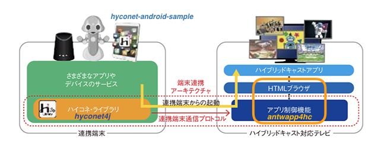
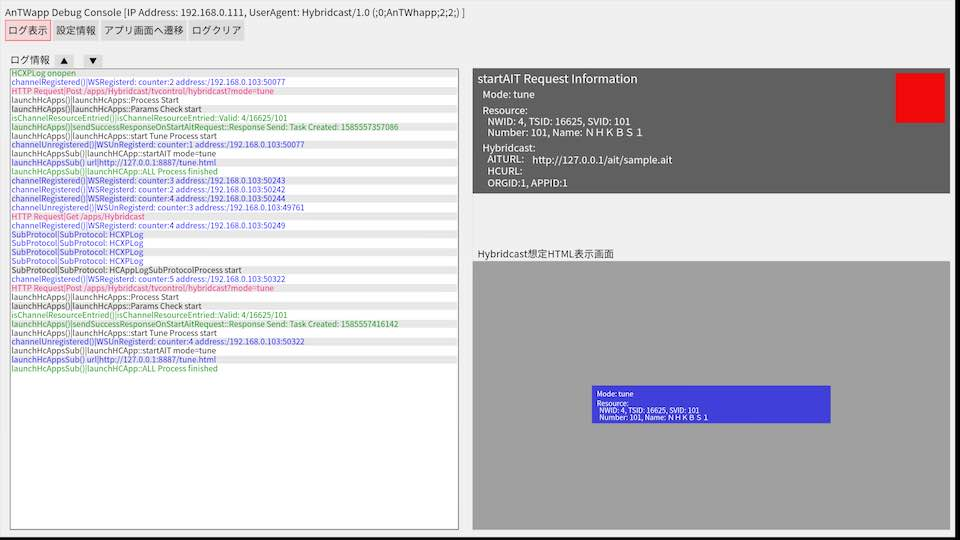

# Antwapp4hc

ハイブリッドキャストコネクトエミュレータ/
ハイコネプロトコル処理用のTV側アプリ(AndroidTV向け)

[English](./README.md) 

## 概要

Antwapp4hcは、IPTV Forum Japanにおいて2018年9月に標準規格化された「ハイブリッドキャストコネクト」(以後、ハイコネ)のプロトコルに対応したAndroidTV向けハイコネアプリ制御モジュールの実装例です。ハイコネプロトコルの連携端末側実装である[hyconet4j](https://github.com/nhkrd/hyconet4j)と対向で利用することができます。ハイコネを利用すると、一部の放送受信機能を受信機外のアプリケーションから制御でき、その受信機および受信機上のハイブリッドキャストアプリケーションと通信ができます。本アプリケーションは、受信機側機能のエミュレーターとして、ハイコネのプロトコルテストで利用されているツールの一部をOSS化したものです。
また本アプリケーションを使うと、ハイコネのプロトコルの動作状況をみることができます。

ハイコネについて詳しくは、[About "Hybridcast-Connect"](./HybridcastConnect.md)を参照ください。本ソフトウェアの利用に関しては、LICENSEおよびNOTICEファイルを参照ください。



- Reference
    - [About "Hybridcast-Connect"](./HybridcastConnect.md)
    - [IPTVFJ STD-0013 "ハイブリッドキャスト運用規定"](https://www.iptvforum.jp/download/input.html)
    - [W3C TPAC2018 Media & Entertainment IG "Recent Achievement Of Hybridcast in TPAC2018"](https://www.w3.org/2011/webtv/wiki/images/4/45/RecentAchievementHybridcast_TPAC20181022.pdf)
    - [W3C TPAC2019 Media & Entertainment IG "Recent Achievement Of Hybridcast in TPAC2019"](https://www.w3.org/2011/webtv/wiki/images/d/d1/MediaTimedEventsInHybridcast_TPAC20190916.pdf)
    - [W3C TPAC2020 Media & Entertainment IG "Recent Achievement Of Hybridcast in TPAC2020"](https://www.w3.org/2011/webtv/wiki/images/2/22/RecentUpdateHybridcast_TPAC20201021_%281%29.pdf)


## 環境

- Android(TV) OS
  - AndroidTVOS
    - AndroidTV OS 7.0
    - AndroidTV OS 8.0
  - FireOS
    - FireTVStick（第2世代モデル）: Fire OS 5.2.6.6(AndroidOS:5.1 base)
    - FireTVStick（第3世代モデル）: Fire OS 6.2.6.6(AndroidOS:7.0 base)

- Dependencies (詳細は"build.gradle"を参照ください。)
  - commons-codec-1.10.jar
  - jzlib-1.1.3.jar
  - netty-buffer-4.1.48.Final.jar
  - netty-codec-4.1.48.Final.jar
  - netty-codec-http-4.1.48.Final.jar
  - netty-common-4.1.48.Final.jar
  - netty-resolver-4.1.48.Final.jar
  - netty-transport-4.1.48.Final.jar
  - netty-handler-4.1.48.Final.jar
  - JSON-java-20170220.jar (注: [License](#license)をご覧ください。)
  - Android SDK/packages
    - com.android.tools.build:gradle:3.5.3
    - com.android.support:leanback-v17:21.0.3
    - com.google.android.gms:play-services:8.3.0

---

## ビルド


### Android Studioの場合

Android Studio 使ってビルドする。

### dockerの場合

docker を使ってビルドする。
docker-composeを使うこともできる。

```bash
$ ./make_docker_image.sh
$ ./build_in_docker.sh
```

または

```
$ docker-compose build
$ docker-compose up
```

## ディレクトリ

### ./app/libs

- Dependencies
  - JSON-java-20170220.jar (注:[License](#license)をご覧ください。)


### ./docs

  - APIその他に関する文書

---

## インストール

Android Studioまたはdockerでビルドしたパッケージ(apk)をAndroid Studioあるいはadbコマンド等でインストールする.


### AndroidTVOS

- ネットワークを設定する。
- インストール
    - 設定メニューで"Developer mode"にする。
    - ADB Debugを"Enabled"にする。
    - adbコマンドを使ってインストールする。
  ```
  adb connect [IPAddress of AndroidTV]
  adb install [apk file name of AndriudTV]
  ```

### FireOS

- ネットワークとアカウントを設定する。
- インストール
  -  [Setting] -> [MyFireTV] -> [Developer Option]で以下のように設定する。(FireTV説明書を参照のこと)
      - ADB Debug "Enabled".
      - Unknown App(または不明なアプリ) "Enabled".
  - adbコマンドを使ってインストールする。IPアドレスは[Setting] -> [MyFireTV] -> [VersionInfo] -> [Network]で表示される(FireTV説明書を参照のこと)

  ```
  adb connect [IPAddress of FireTVStick]
  adb install [apk file name of FireTVStick]
  ```

### AndroidOS

TBD

---

## 使用方法

---

### 起動

インストール後、インストールしたandroidTV受信機もしくはFireTVのホーム画面で"antwapp"のアイコンを探して起動します。

- adbで起動する場合

  adbコマンドによるantwapp4hcアプリの起動方法は以下のとおりです。（再起動も同様）

  ```bash
  adb shell am start -n "jp.or.nhk.rd.antwapp4hc/.WebViewActivity" -s
  ```

### Application View

"antwapp4hc"はデバイスのディスプレイでデバッグメッセージの表示や設定変更を行うことができます。以下はその説明です。詳細は[antwapp_ui.md](./docs/antwapp_ui.md)を参照ください。

- Log Area
- startAIT Request Information Area
- WebBrowser(Hybridcast) Display Area




#### ウィンドウ内のタブ

タブにより以下の画面に切り替えることができます。詳細は[antwapp_ui.md](./docs/antwapp_ui.md)を参照ください。

- ログ表示

  Antwapp4hcが通信した際の受信・処理・応答に関するメッセージ表示する。debugメッセージも出力される。

- 設定情報

  以下パラメータが設定できる。

  - aitload
  - wsBroadcastMode
  - aitVerify
  - hcViewMode
  - tuneDelay

- アプリ画面へ遷移

- ログクリア

  ログを消去する。

---
## HTML

"antwapp4hc"はAndroidTVアプリのコンソール画面およびブラウザで表示可能な画面をHTMLで記述している。一部はantwapp4hcのAPIに対するUIのサンプルとなっている。

```
-- assets
  |-- config.html  <-- 設定フォーム
  |-- console.html <-- デバッグコンソール(Andoroidアプリのhome viewと同じ)
  |-- hc.html      <-- ブラウザの全表示
  |-- hcsub.html   <-- ブラウザの部分表示
  |-- hcxplog.html <-- ログ
  |-- hybridcast   <-- ハイブリッドキャストアプリのディレクトリ(サンプル)
  |-- index.html   <-- antwapp4hcのトップページ
  |-- tune.html    <-- 選局状況の表示
  `-- wsclient.html<-- データとAPIのチェック用WebSocketクライアント
```

- 上記のHTMLにブラウザでアクセスするには

  ```
  http://[IPAddress]:8887/[html-file-name]
  
  Ex. http://[IPAddress]:8887/console.html
  ```

---

## [APIs](./docs/apidocs.md)

antwapp4hcは、REST APIおよびWebSocketのサーバーとして、以下2種類のAPIを提供する。

詳細は[API documents](./docs/apidocs.md)を参照ください。

- [IPTVFJ STD-0013](./HybridcastConnect.md#iptvfj-std-0013)で規定されたREST APIおよびWebSocket API
- antwapp4hcの管理・制御のためのREST APIおよびWebSocket API

---

## W3c WoTデバイスのための参照実装

"antwapp4hc"は、W3C Web of Things(WoT)IG/WGにおける以下の機能の一部を参照実装として実装し、WoTグループのPlugfest(相互運用テストイベント)に貢献しています。

- Wot Discovery: mDNS-SD.
- WoT ThingDescription: ThingDescription for Hybridcast-Connect implemented TVSet.


# ライセンス

本ソフトウェアのライセンスについては[LICENSE.txt](./LICENSE.txt)および[NOTICE.txt](./NOTICE.txt)を参照ください。

---

なお、本リポジトリには以下の理由により他のOSSパッケージを含みます。


- JSON-java-20170220.java ([License](https://github.com/stleary/JSON-java/blob/master/LICENSE))

    - Repository: https://github.com/stleary/JSON-java
    - LICENSE: https://github.com/stleary/JSON-java/blob/master/LICENSE

    標準的なJSONのjava実装のためこれを利用。ただし、androidで利用する場合、[当OSSのpackageName "org.json"が競合する](https://github.com/stleary/JSON-java/wiki/JSON-Java-for-Android-developers)ため、本"antwapp4hc"リポジトリに、androidでの利用を想定したpackageNameを"JSON-java"へ変更したものを同梱。ライセンスについては[License](https://github.com/stleary/JSON-java/blob/master/LICENSE)を参照

- focus-manager.js (BSD-3-Clause)

  AndroidTVやFireStickなどのデバイス上の画面フォーカス遷移のために利用している。ライセンスについては[focus-manager.js](./app/src/main/assets/js/focus-manager.js)を参照。

