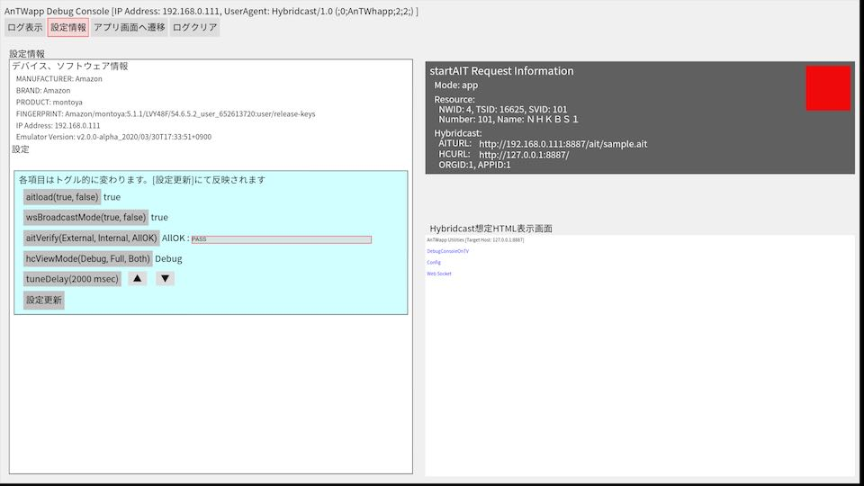

## About Application View on Antwapp

[English](./antwapp_ui.md) 

### Application View

"Antwapp4hc"は、デバッグメッセージの表示や設定変更のための画面を用意しています。デバイス上のディスプレイにAndroidアプリとして表示します。以下はその説明です。

- Log エリア

  "Antwapp4hc"が通信した際の受信・処理・応答に関するメッセージをログとして表示する.

  | 色 | メッセージの意味 |
  | :---: | :--- |
  | 赤 |  - ハイコネプロトコル対応APIにおけるエラーメッセージ。 |
  | 緑 | - ハイコネプロトコル対応APIの処理完了メッセージ。 |
  | 青 | - ハイコネプロトコル対応APIの受信メッセージ。 |
  | 黒 | - ハイコネプロトコル対応APIからの詳細情報。 |
  | 黄 | - ハイコネプロトコルにおけるWebSocketによる連携端末通信に関係する受信・処理・応答に関するメッセージ。 |

- startAIT Request Information エリア

  選局・ハイブリッドキャストアプリの起動が連携端末から要求された際に、リクエストの内容(選局する編成チャンネル、ハイブリッドキャストアプリのAITのURLなど)を表示する。

  - Mode:
    - 選局のみ/ハイブリッドキャストアプリ起動のリクエストの種別
  - Resource:
    - 編成チャンネル情報
      - NWID: original_network_id
      - TSID: transport_stream_id
      - SVID: service_id
  - Hybridcast: 
    - AITURL: 起動要求に含まれるハイブリッドキャストアプリのAITのURL
    - HCURL:  AITURLで参照されるAIT中に記述されるハイブリッドキャストアプリのURL
    - ORGID:  IPTVFJ STD-0010で規定されるorgid
    - APPID:  IPTVFJ STD-0010で規定されるappid

- Hybridcast想定HTML表示画面

  - 連携端末からの選局/ハイブリッドキャストアプリ起動要求に対するTV側の動作を表示する。選局のみの要求の場合は、選局されたことを意味する内容を表示するアプリ内部にあらかじめ実装してあるHTML文書が表示される。ハイブリッドキャストアプリ起動要求では、選局のみの要求の場合の動作に加えて、指定されたURLによって起動されるハイブリッドキャストアプリを表示する。

#### ウィンドウ内のタブ

タブによって、以下の画面に切り替えることができる。

- ログ表示

  Antwapp4hcアプリが通信した際の受信・処理・応答に関するメッセージ表示するタブ。debugメッセージも出力する。

- 設定情報

  - aitload
    - 選局/ハイブリッドキャストアプリ起動要求に含まれるURLで取得する対象を切り替える。trueにするとAITを取得し、falseにすると指定されたURLから直接ハイブリッドキャストアプリを取得する。falseはアプリケーション開発を容易にするために設けられたもので、"Hybridcast-Connect"の規程に準拠しない動作であることに注意すること。
  - wsBroadcastMode
    - "Antwapp4hc"がWebSocketでメッセージを受信した時に、受信したメッセージを送信元以外の"Antwapp4hc"と連携中のすべての連携端末にエコーする機能のOn(true)/Off(false)。
  - aitVerify 
    - AITURL可否判定サーバーを選択する。
      - External: 右のフィールドで指定するURLによって参照されるAITURL可否判定サーバーを利用する。
      - Internal: "Antwapp4hc"内に疑似的に実装されたAITURL可否判定サーバーを利用する。
      - AllOK: 可否判定処理がスキップされ、常に選局、ハイブリッドキャストアプリの起動が許可される。
  - hcViewMode
    - ディスプレイに表示される内容はハイブリッドキャストアプリのみの場合とDebugメッセージ付きの場合の2種類がある。どちらを表示するのかの切替はリモコンのボタンによって行う。hcViewModeで2種類のどちらを表示の更新対象にするのかを選択する。
      - Debug: Debugメッセージ付きのもののみ更新する。
      - Full: 全画面で表示されるハイブリッドキャストアプリのみ更新される。
      - Both: 2種類の表示が常に更新される。
  - tuneDelay(milliseconds)
    - 選局要求を受信した際の選局処理実行の前に入れる遅延時間
- アプリ画面へ遷移
  - 未実装
- ログクリア
  - ログ画面をクリアする

  
