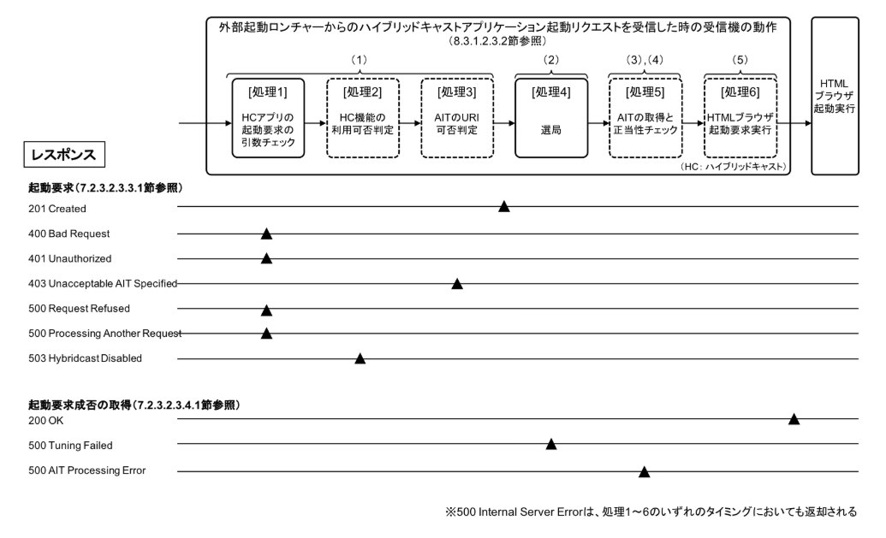

# TaskStatusAPI

ハイブリッドキャストアプリ起動要求成否取得API.

### Abstract

起動要求を受理した後の受信機の処理結果を受信機へ要求し、取得する.

"[IPTVFJ STD-0013](http://www.iptvforum.jp/download/input.html) 7.2.3.2.3.4.1 起動要求成否の取得"を参照.

## AnTwapp(Receiver/Server-Side)

### WebAPI(Method, endpoint, Parameter, Response)

#### Request

```
HTTP/1.1
GET <BASEURL>/hybridcast
```

#### Response

```
HTTP/1.1 200 OK

{
    "head": {
        "code": 200,
        "message": "OK"
    },
    "body": {
        "taskid": "15180375",
        "result": {
            "status": "Done",
            "code": 200,
            "message": "OK"
        }
    }
}
```

- スキーマ

フィールド | 型 | 説明
--- | --- | ---
head | Object | HTTPステータスラインの情報を含むオブジェクト
code | Number | HTTPステータスコード
message | String | HTTPステータスコードの説明句.なお、受信機の状態を示す文字列も含まれる
body | String | 下記のtaskid, resultを含むオブジェクト
taskid | String | 起動要求APIが返す起動要求プロセスの識別子.起動要求のレスポンスに含まれるtaskidの値と同じ場合は、その起動要求に対する結果であることを意味する
result | Object | 下記のstatus, code, messageを含むオブジェクト.taskid毎に値を返す
status | String | 受信機における起動要求の実行状態を示す文字列.実行状態に変化がなければクリアはされない.実行状態と受信機の動作処理の関係は以下図参照.
code | Number | 起動要求の実行結果を示すコード
message | String | 起動要求の実行結果を示す文字列


### APIレスポンスの補足

---

- body.taskidの値について

ANtwapp(受信機）がHCアプリ起動要求の受付完了時に、一定時間において重複した値とならないように発行する.
外部アプリは、起動要求時に取得したtaskidと同じtaskidであるかどうか確認して、自身が起動要求した、起動要求受付後のHCアプリの起動状況やエラー状態を把握するために利用する.

taskidの文字列 | 状態
--- | ---
"0" | 初期状態
"連番文字列" | 起動要求受付完了
起動要求前の値を維持 | 起動要求受信時にエラー発生

---


- body.result.statusの取りうる値について

body.result.statusの値 | 起動モードの説明 | 備考
-- | -- | --
Done | 完了: InProcess以外の状態.一度も起動要求されていない時もDone.起動要求でmode=tuneの時は選局実行後の状態もDone | 実際にブラウザが起動成功してWebアプリがロードされた状態ではない
InProcess | 処理中: 起動要求APIを受信時点から、Web(HC)ブラウザ起動リクエスト実行までの状態 |
Error | 失敗: 起動要求APIを受信してからの処理においてErrorが発生した場合の状態 | エラーコードは別途


---

- 状態遷移解説

    - HC起動要求が一度もされていない場合（初期状態デフォルト）

        statusはDone

    - HC起動中に、tune要求での切り替えがあった場合

        - 起動リクエスト受信時に、status: InProcess
        - リソース切替（選局）実行後、status: Done

    - HC起動中に、app要求での切り替えがあった場合(tune用リソースが現状と同じ場合、異なる場合)

        - 起動リクエスト受信時に、status: InProcess
        - ブラウザ起動実行後に、status: Done

---


- result.statusに対するStatusCodeとStatusMessageの関係について

上記result.statusに対してstatusCodeとstatusMessageを以下に示す.

body.result.status | body.result.status | body.result.message | 説明
-- | -- | -- | --
Done | 200 | 0K | 起動要求の実行が正常に完了.codeは200以外に取りえない
Error | 500 | Tuning Failed | 選局失敗
Error | 500 | AIT Processing Error | 放送休止
Error | 500 | Internal server error | 上記以外の受信機の内部エラー




## ClientSide(Recommendation)

#### Javascript AP

```
Promise getTaskStatusFromHostDevice()
```

"[IPTVFJ STD-0013](http://www.iptvforum.jp/download/input.html) 7.1.7.3.1 起動要求成否の取得"を参照.
