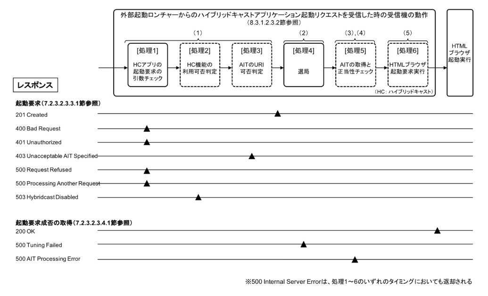
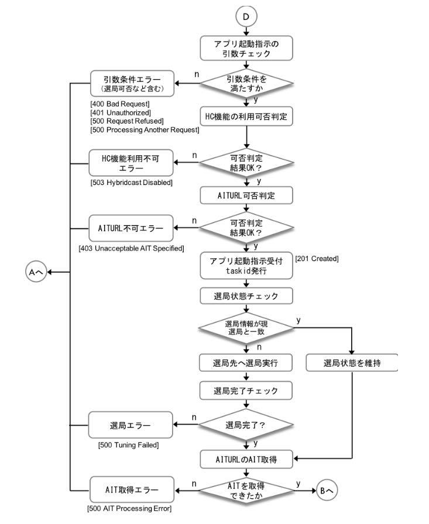

# StartAITAPI

ハイブリッドキャストアプリ起動要求API.

## Abstract

POST データで指定する情報に従ってハイブリッドキャストアプリケーションの起動を受信機へ要求する.

リソース切替（選局）の後、ハイブリッドキャストブラウザを起動し、ハイブリッドキャストアプリ起動をするAPI. 
antwapp4hcにおいては、ブラウザはHTML5ブラウザ(webview)、ハイブリッドキャストアプリはwebアプリとして動作する.

起動パラメータにより、

 - 選局（リソース切替）のみ[tune指定時]
 - 選局＋hybridcast起動[app指定時]
 - 放送非依存マネージドアプリケーション起動[bia指定時]

を指定する.

"[IPTVFJ STD-0013](http://www.iptvforum.jp/download/input.html) 7.2.3.2.3.3.1 起動要求"を参照.

## AnTwapp(Receiver/Server-Side)

### WebAPI(Method, endpoint, Parameter, Response)

#### Request

```
HTTP/1.1
POST <BASEURL>/hybridcast?mode=MODE

{
    "resource": {
        "original_network_id": 32726,
        "transport_stream_id": 32726,
        "service_id": 1024
    },
    "hybridcast": {
        "aiturl": "https://example.com:8887/ait/sample.ait",
        "orgid": 16,
        "appid": 1
    }
}
```

- BaseURL <- DialApplicationInformationのXMLにおけるX_Hybridcast_TVControlURL値

#### schema

- [startAIT_request_schema.json](../../app/src/main/assets/json-schema/startAIT_request_schema.json)


フィールド | 型 | 説明
--- | --- | ---
resource | Object | original_network_id/transport_stream_id/service_idを含むオブジェクト
original_network_id | Number | オリジナルネットワーク識別子(範囲は[0..65535])
transport_stream_id | Number | トランスポートストリーム識別子(範囲は[0..65535])
tlv_stream_id | Number | TLVストリーム識別子(範囲は[0..65535])
service_id | Number | サービス識別子(範囲は[0..65535])
hybridcast | Object | aiturl/orgid/ appidを含むオブジェクト
aiturl | String | 実行対象となるハイブリッドキャストアプリケーションのXML-AITのURL
orgid | Number | 事業者ID (範囲は[0..65535])
appid | Number | アプリケーションID (範囲は[0..4294967295])


- MODEについて

MODEが取りうる値 | 起動モードの説明 | 備考
-- | -- | --
app | resourceオブジェクトをもとに選局後、hybridcastオブジェクトをもとにHybridcast起動 | 指定しない場合はデフォルト
tune | resourceオブジェクトをもとに選局 | ****
bia | 放送非依存マネージドアプリケーション(Broadcast-Independent managed Application)の起動要求 | ****


#### Response

```
HTTP/1.1 200 OK

{
    "head": {
        "code": 201,
        "message": "Created"
    },
    "body": { // Errorの時、bodyオブジェクトは空オブジェクト
        "taskid": "15180375"
    }
}
```


- taskidについて

ANtwapp(受信機）が起動要求の受付完了時に、一定時間において重複した値とならないように発行する.文字列のフォーマットはなんでもよいため、antwappでは連番数字を文字列化したものとする.

taskidの文字列 | 状態
--- | ---
"0" | 初期状態
"連番文字列" | 起動要求受付完了
起動要求前の値を維持 | 起動要求受信時にエラー発生


#### schema

- [startAIT_response_schema.json](../../app/src/main/assets/json-schema/startAIT_response_schema.json)

フィールド | 型 | 説明
--- | --- | ---
head | Object | HTTPステータスラインの情報を含むオブジェクト
code | Number | HTTPステータスコード
message | String | HTTPステータスコードの説明句.なお、受信機の状態を示す文字列も含まれる
body | String | taskidを含むオブジェクト
taskid | String | 起動要求の識別子.起動要求成否状態取得API利用する際に、複数の起動要求を識別するために用いる.一定時間内においては起動要求毎にユニークな値が返却される.

#### StatusCode

code | message | 説明
--- | --- | ---
201 | Created | 受信機が起動要求を受理
400 | Bad Request | 起動要求に含まれるクエリやリクエストのデータ形式が不正
401 | Unauthorized | 受信機とコンパニオンアプリケーションの端末認証エラー
403 | Unacceptable AIT Specified | AITのURLの妥当性評価結果が妥当でない
500 | Processing Another Request | 受信機においてすでに他の起動要求が実行中である
500 | Request Refused | 受信機が起動要求の受付に失敗
503 | Hybridcast Disabled | ハイブリッドキャストアプリケーションの利用機能が無効化されている
500 | Internal Server Error | 上記以外のエラーが発生




---


### 参考：HCアプリ起動リクエスト受信後のAntwappの処理フロー

以下は受信機がHCアプリ起動リクエストを受信した後の処理フローの例である.

エミュレーターの各処理機能に読み替えて実装している.




なお、図中のA,B,Dの状態は以下である.

図中の状態 | 受信機の状態 | Antwappの状態
--- | --- | ---
[A] | 受信機における放送受信して映像音声のみの提示状態（選局直後）| 指定放送局(Triplets)の再選局.Web(HC)アプリは終了されている.
[B] | HCアプリ起動前のAIT正当性チェック処理 | Web(HC)アプリ起動前のAIT正当性チェック処理
[D] | HCアプリ起動要求受信時の状態 | HCアプリ起動要求受信時の状態


## ClientSide(Recommendation)

#### Javascript API

```
Promise startAITControlledAppToHostDevice()
```

"[IPTVFJ STD-0013](http://www.iptvforum.jp/download/input.html) 7.1.7.2.1 起動要求"を参照.
